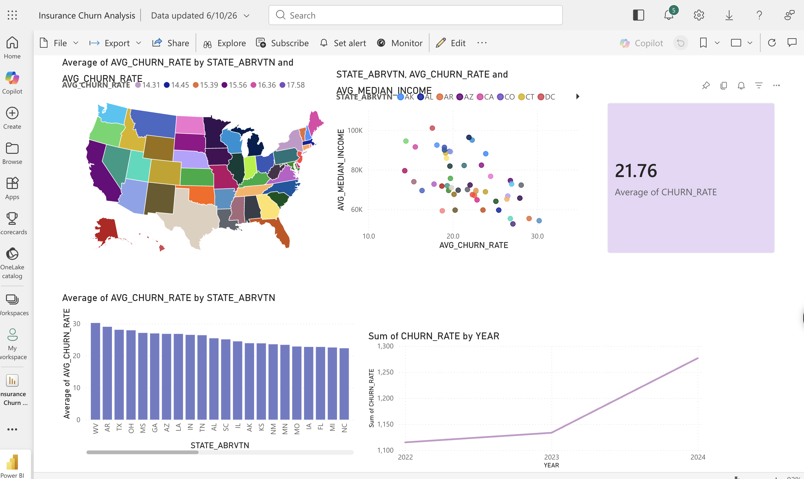

# 🏥 Health Insurance Mid-Year Churn Analysis

> **"Why do Americans drop their health insurance mid-year — and where should insurers intervene?"**

## 📊 Live Dashboard
[View Power BI Dashboard](https://app.powerbi.com/groups/me/reports/4d45924d-e5bd-4310-b0d7-abe43ba34282)

## 🔍 The Problem
Mid-year health insurance churn costs insurers billions in lost premium revenue annually. This project identifies **which states are most at risk, why, and when** insurers should intervene.

## 💡 Key Findings
| Metric | Value |
|--------|-------|
| National avg churn rate | 21.76% |
| Highest churn state | West Virginia (30.24%) |
| vs national average | 1.4x higher |
| Churn trend 2022→2024 | ↑ 20.65% to 23.64% |

- **Where:** Southern and rural states dominate the top 15 highest-churn states
- **Why:** States with lower median income show significantly higher dropout rates
- **When:** Churn spikes in 2024 — likely tied to expiring ARP subsidy enhancements

## 🎯 Business Recommendation
Insurers should target **proactive Q2 outreach** to low-income enrollees in high-churn Southern states before the annual Q3 spike — potentially protecting billions in at-risk premium revenue.

## 🛠️ Tools & Stack
- **Python** (Pandas, NumPy) — data cleaning, EDA, churn rate calculation
- **Snowflake** — cloud data warehouse, SQL views, live Power BI connection
- **Power BI** — interactive dashboard with Snowflake DirectQuery
- **Data Sources** — CMS Marketplace Public Use Files (2022–2024), US Census ACS S1901

## 📁 Project Structure
├── 01_eda.ipynb          # Full Python analysis
├── churn_final.csv       # Cleaned merged dataset
└── dashboard_screenshot.png
## 👩‍💻 Author
Sree Harshita Maddipati | [LinkedIn](https://linkedin.com/in/sreeharshita) | [sreeharshita.com](https://sreeharshita.com)
